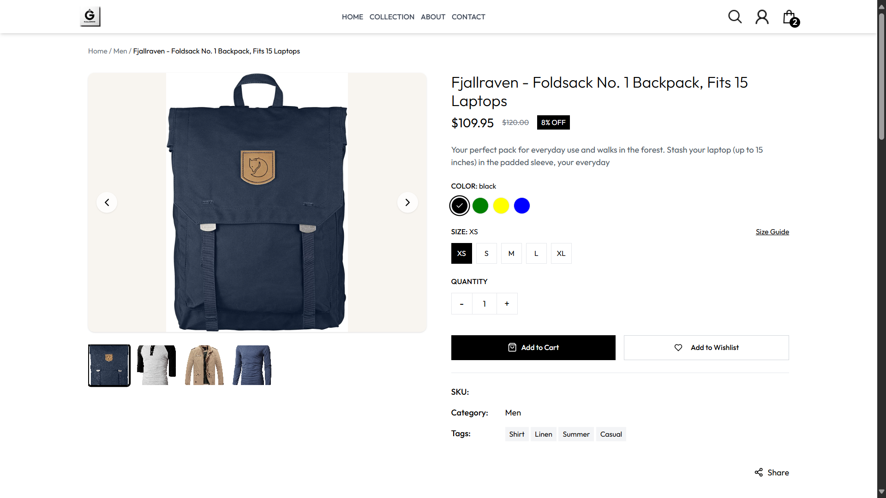
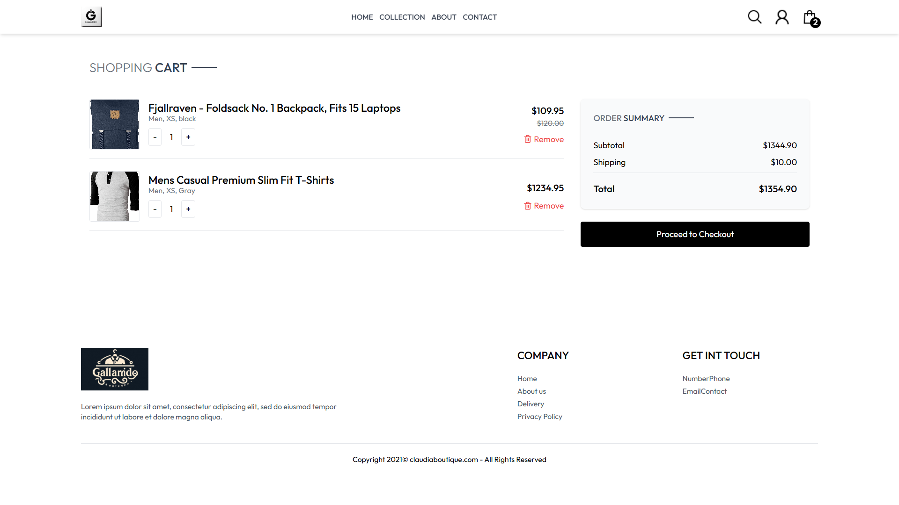
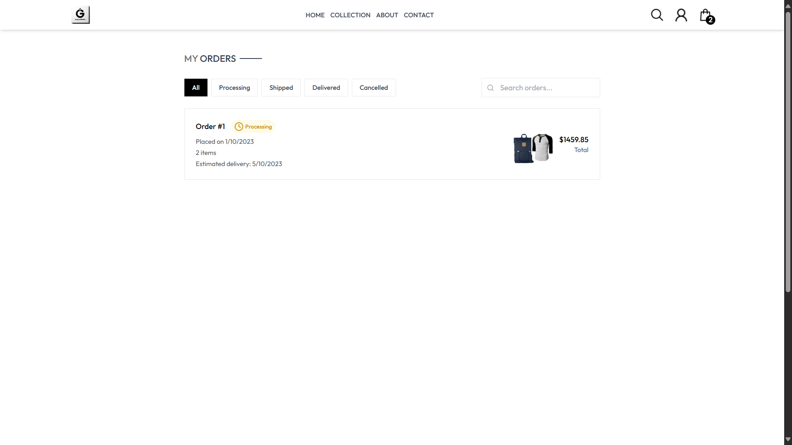

# 🛍️ Gallarido Store

**Gallarido Store** es una tienda en línea moderna, estilizada y responsiva que permite a los usuarios explorar productos, ver detalles, añadir artículos al carrito y completar su compra. Diseñada para ofrecer una experiencia visual limpia y una navegación intuitiva.

---

## 🖼️ Vista previa del proyecto

<!-- Agrega aquí las capturas o video de demostración -->

<!-- Puedes agregar un video también -->
<!--  -->

---

## 🚀 Funcionalidades

- 🧭 Navegación clara: Home, Colección, Acerca de, Contacto.
- 🔍 Exploración de productos por categoría.
- 🛒 Carrito de compras interactivo con:
  - Control de cantidad por producto.
  - Eliminación de productos.
  - Cálculo dinámico de subtotal, envío y total.
- 🏷️ Sistema de tallas y colores seleccionables en página de producto.
- 🎯 Diseño completamente responsivo y amigable con el usuario.
- 💬 Wishlist y guía de tallas incluidas.
